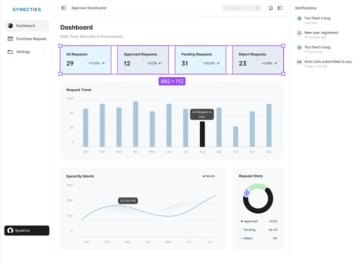
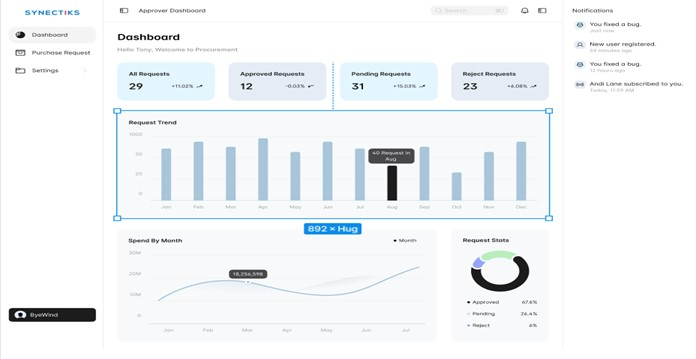
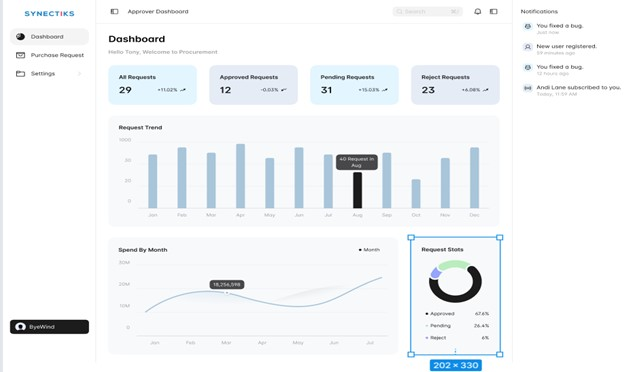
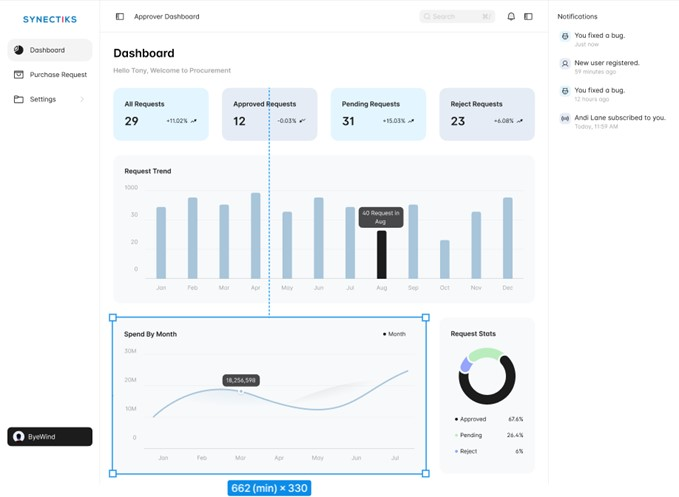

# Use Case for Procurement Approver Dashboard

## Actors:
- Approver
- Admin

## Use Case Description:
This use case outlines the typical user interactions and system responses for the Procurement Approver Dashboard, covering both normal and alternative flows to ensure a smooth user experience and error handling.

## Trigger point:
User Login and Access Request:
- The trigger point occurs when a procurement approver logs into the procurement system and requests access to the Procurement Approver Dashboard.

## Preconditions:
- Users must have valid credentials and be logged into the procurement system.
- The user must have the role of a procurement approver.
- The system must have relevant data on procurement requests, including their status, requestors, and spending information.

## Post-conditions:
- The dashboard displays updated information based on the user's interactions.
- Data presented on the dashboard reflects the latest procurement request statuses and spending statistics.
- The dashboard retains user preferences and selections for a seamless experience.

## Normal Flow:
### Top Panel:
The dashboard's top panel displays the following metrics:
- All Requests: Displays the total number of requests a requestor has.
- Success Requests: Displays the total number of success requests.
- On-Hold Requests: Displays the on-hold requests.
- Reject Requests: Displays the reject requests.
- Pending Requests: Displays the pending requests.

### Following Panels Show:
- The Recent Overview of The Requestor Dashboard.

   
   

### Request Trend:
- The vertical bar graph updates to display the number of requests based on the selected time frame.

   
   

### Requisition Stats Panel:
- The donut chart updates to represent requisition statistics based on the selected time frame.

   
   

### Spend by Month Panel:
- The line graph displays spending information for the entire year.
- User interacts with a dropdown to select the time frame (day, week, month, or year).

   
   

## Alternative Flow (Error Handling):
- Invalid Credentials:
  - If the user enters invalid credentials, an error message is displayed, prompting the user to enter valid information.
- No Data Available:
  - If no data is available for the selected time frame in any panel, a message is displayed indicating the absence of data.
- Dashboard Access Permissions:
  - If a user without the procurement approver role attempts to access the dashboard, an error message is displayed, informing the user of insufficient permissions.
- Technical Issues:
  - If technical issues are preventing the dashboard from loading or updating, an error message is displayed, and the user is prompted to try again later.

## Additional Notes:
- The procurement approver may perform these actions periodically for monitoring and decision-making.
- The dropdowns in each panel allow the user to customize the data displayed, enhancing the dashboard's flexibility and usefulness.
