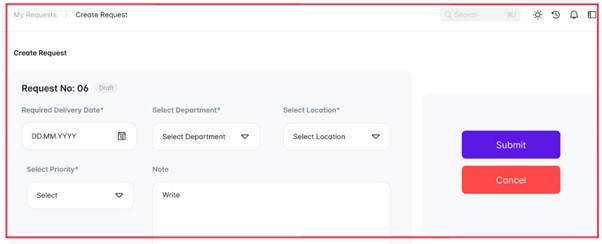
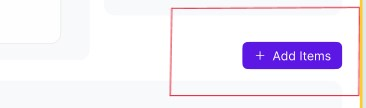
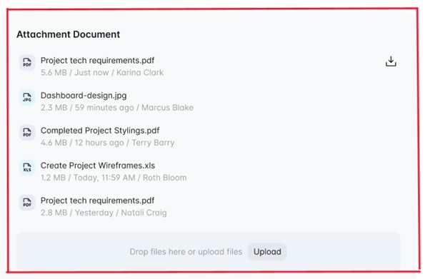

# Create Purchase Request

## Actor
- Admin
- Approver
- Requestor

## Use Case Description:
This use case allows the requester to create a new request for products, services, or contracts, attach relevant documents, and submit it for approval. The approver can then review the request and either approve or reject it.

## Trigger:
The requester needs to create a new request for a product, service, or contract.

## Pre-Condition:
- The requester is logged into the system.
- The requester has the necessary permissions to create a new request.
- The requester has the required information, such as the expected delivery date, department, location, and request type, to create the request.

## Post Condition:
- If the request is approved, the system will initiate the necessary actions to fulfill the request.
- The user will be able to access the request and track its progress.
- If the request is rejected, the requester will receive a notification explaining the reason for rejection.

## Normal Flow:
1. The user clicks on the "Create new request" button, which opens the "New create request" form.
2. 

   
   

3. The user selects the Desired delivery date, department, location, and request type.
4. The user enters a note to provide a reason for the request.
5. The user clicks on the "Add items" button to browse the internal catalog and select the required products or services. Alternatively, the user can click on the "Add Custom item" button to manually add a single order line or click on the "Import item" button to import bulk orders through a CSV file.
6.  

   
   

7. The user can click on the "Attach documents" button to upload any relevant documents related to the procurement request.
 

   
   

8. Once all the required information is entered, the user clicks on the "Submit" button.
9. The status of the request changes from "draft" to "pending," and the request is submitted for approval.

## Alternative Flow:
- If the approver rejects the request, the user can modify the request based on the feedback provided by the approver and resubmit the request for approval.
- If the approver approves the request, the procurement process can continue, and the requested items or services can be procured.
