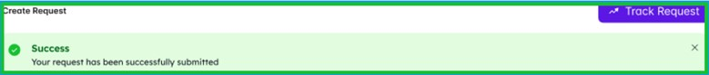
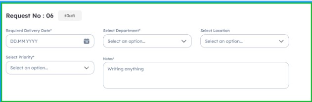
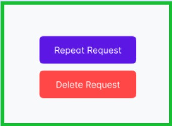
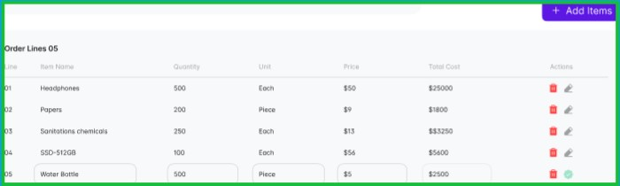
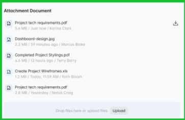

# Purchase Requisitions Form For Create - Request Success Track Button Use Case

## Actors
- **Requestor**

## Description
To streamline the process of creating purchase requisitions by providing users with a well-structured form. The form includes essential details, such as required delivery date, department, location, priority, and order line items. Additionally, users have the option to attach documents and add comments. The interface also offers the functionality to track requests and provides clear feedback on successful submissions.

## Trigger Point
The trigger point for this use case is when a user decides to create a new purchase requisition.

## Precondition
The user must have valid login credentials and appropriate access rights to access the purchase requisitions form.

## Normal Flow

1. **Login:**
   - The user logs in to the system using valid credentials.

2. **Access Purchase Requisitions Form:**
   - The user navigates to the purchase requisitions section.

3. **Top Panel Overview:**
   - The top panel displays the following items:
     - "Track Request" button for monitoring the status of submitted requisitions.
     - A success message indicating that the requisition has been successfully submitted.
 

   
   

4. **Form Entry:**
   - The user fills in the required details in the form:
     - Required Delivery Date
     - Select Department
     - Select Location
     - Select Priority
     - Notes (free-text input)
 

   
   

5. **Repeat Request Confirmation:**
   - After submitting the form, a confirmation message asks the user if they are sure they want to repeat the requisition.
   - Options include "Repeat" and "Cancel”.
 

   
   

6. **Order Line Details:**
   - The user enters details for each item in the requisition:
     - Line Number (automatically assigned)
     - Item Name
     - Quantity
     - Unit
     - Price
 

   
   

7. **Attachment Document:**
   - The user has the option to attach relevant documents to the requisition.
 

   
   

8. **Comment:**
   - The user can add comments to provide additional information or context.
 

   
   

9. **Repeat Request Confirmation (Post Submission):**
   - After confirming the repeat action, the system verifies whether repeating the requisition is possible.
   - If possible, the requisition is repeated.
   - If not possible, a notification informs the user that this action cannot be done.

## Post Condition
Upon successful submission, the requisition is added to the system, and relevant stakeholders are notified. If the user chooses to repeat the requisition, the system either repeats the requisition or notifies the user that the action cannot be done.

## Alternative Flow

1. **Invalid Login:**
   - If the user enters incorrect login credentials, the system triggers an authentication error message, prompting the user to enter valid credentials.

2. **Cancel Repeat Action:**
   - If the user chooses to cancel the repeat action, the system cancels the operation, and the requisition remains unchanged.

3. **Error in Form Entry:**
   - If there's an error or omission in the form entry, the system triggers an error message, guiding the user to correct the information.

4. **Repeat Request Not Possible:**
   - If repeating the requisition is not possible (e.g., due to system constraints or policy), the system notifies the user, and the requisition remains unchanged.

## Benefits
- **Clear Submission Feedback:**
  The user receives clear feedback on the success of the requisition submission.
  
- **Efficient Repeat Option:**
  Users can choose to repeat a requisition with a simple confirmation process.
  
- **Comprehensive Form:**
  The form allows the user to provide detailed information, attachments, and comments.
  
- **Track Request Functionality:**
  The "Track Request" button enables users to monitor the status of their submitted requisitions.

By following this use case, organizations can ensure a user-friendly experience for users initiating new purchase requisitions, with the added functionality of repeating requisitions when necessary.
