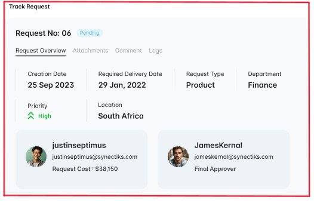
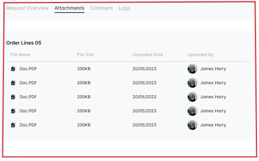
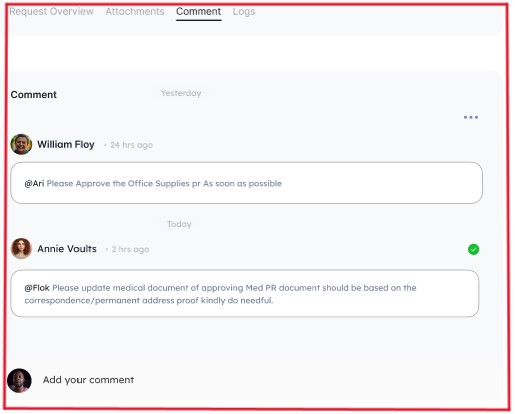
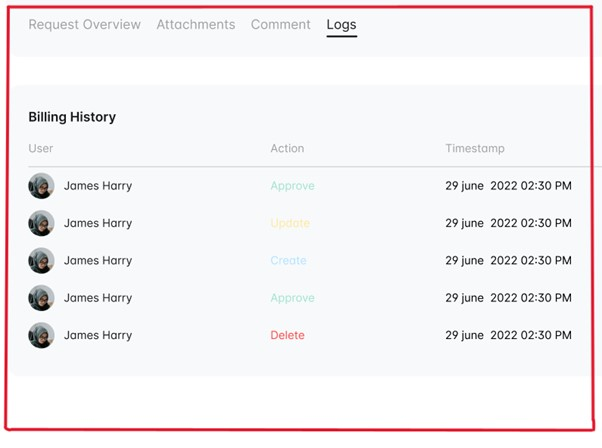

# Track Purchase Request

## Actor
- Admin
- Approver
- Requestor

## Use Case Description:
The user wants to view the details of a specific request to gain more insight into its status and contents.

## Trigger
The user clicks on a specific request in the table on the request screen.

## Pre-Condition:
- The user is authenticated and authorized to view the request details.

## Post Condition:
- The user can view all the information related to the request, including its status, items, attachments, comments, supplier information, and activity logs.

## Normal Flow
1. The user clicks on a specific request in the table on the request screen.
2. The system opens the request details page.
3. The user sees the Request No, tags related to that request, and tabs for request overview, attachments, comments, supplier info, and activity logs.
4. The user clicks on the request overview tab.
5. The system displays the request details, including Requestor name, Location, Delivery Date, Creation Date, request type, department, Item, Final Approver, and total request amount.
6. 

   
   

7. The system displays the Order line item table with the fields Name, Category, supplier, quantity, unit, price, and total cost.
8. 

   
   

9. The user clicks on the attachments tab.
10. The system displays all the attachments related to the request in a table with fields like File name, file size, date uploaded, and Uploaded by.
11. 

   
   

12. The user clicks on the comments tab.
13. The system displays all the comments related to the request.

   
   

14. The user clicks on the supplier info tab.
15. The system displays the information of the supplier, including Supplier name, Supplier email, Supplier contact, business category, telephone No, and Mailing address.
16. The user clicks on the activity logs tab.
17. The system displays all the user activities related to the request in a table with fields like User, action, type, and timestamp.

   
   

## Alternative Flow
- If the user wants to view the attachments related to the request, they can skip step 5 and go directly to step 7.
- If the user wants to view the comments related to the request, they can skip step 5 and go directly to step 9.
- If the user wants to view the supplier information related to the request, they can skip step 5 and go directly to step 11.
- If the user wants to view the activity logs related to the request, they can skip step 5 and go directly to step 13.
