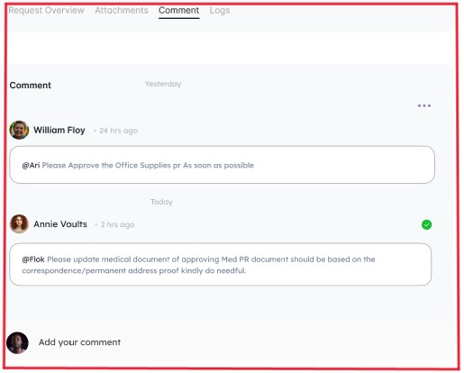

# Use Case of Procurement Purchase Request Screen

## Actors:
- Requester
- Admin
- Approver

## Description:
This use case outlines the functionality of the Procurement Purchase Request Screen, providing an overview of the top panel, left and right panels, and the comment section.

## Preconditions:
- The Procurement Requester is logged into the procurement system.
- The system has up-to-date data on the purchase request.

## Top Panel:
- **Pending Notification:**
  Upon approval of the request, a pending notification is displayed.

   
   

## Second Panels:
Display the following request details:
- Request No.
- Creation Date
- Required Delivery Date
- Request Type
- Department
- Priority
- Location

   
   

### Requester Details:
- Name: [Requester Name]
- Contact: [Requester Contact]
- Email: [Requester Email]

   
   

## Attach Documents:
- The Requester attaches relevant documents to support the procurement request.

## After Attaching Documents:
**Action:**
The Requester reviews the summarized request details through PDF form or Excel sheets.

   
   

## Two Right-Hand Panels:
Display action buttons:
- Approve
- Cancel Request
- Modify Request
- Mark as Completed

   
   

## Three Panels:
Display details of order lines:
- Line
- Name
- Category
- Quantity
- Unit
- Price
- Total Cost
- Status
  

   
   

## Comment Section:
A comment section is provided with a drop-down for actions:
- Resolve
- Reply

   
   

## Postconditions:
- The Procurement Requester has submitted or managed a purchase request with all relevant details.
- The system updates the status of the request based on actions taken.

## Exception Flows:
- If an action fails (e.g., modifying the request, creating an RFQ), the system displays an error message and prompts the user to retry.
- If there is an issue with attaching documents, the system provides feedback and guidance for resolution.

## Notes:
This use case covers the primary features of the Procurement Purchase Request Screen. Depending on specific organizational requirements, additional features and customizations may be necessary.
